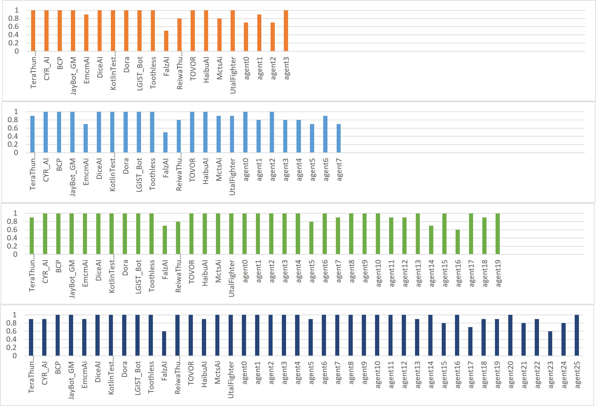
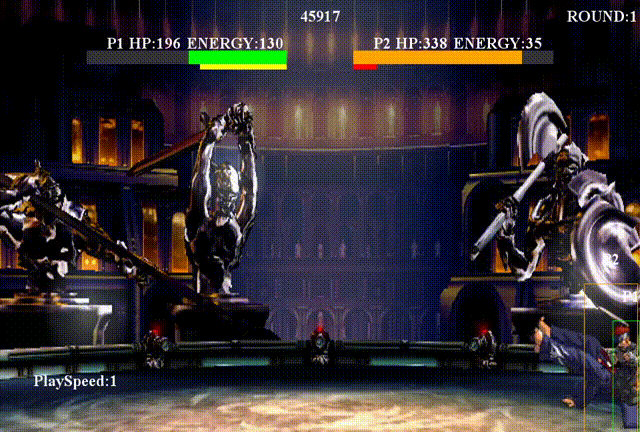

# A Self-Play Framework Tailored for Two-Player Games
This is an intelligent framework, specifically tailored for two-player games such as fighting games, utilizing an opponent pool for the swift creation of artificial entities based on deep reinforcement learning algorithms.
This repository contains:
- [x] The underlying parallel architecture of this framework is implemented using the Ray framework.
- [x] This framework supports two reinforcement learning algorithms, namely Proximal Policy Optimization (PPO) and Phasic Policy Gradient (PPG).
- [x] This framework supports a Self-Play algorithm with customizable opponent selection mechanisms.

## Table of Contents

- [Install](#install)
- [Usage](#usage)
- [Example](#example)
- [Maintainers](#maintainers)
- [Contributing](#contributing)
- [License](#license)

## install
This project can be installed on a single machine or in a multi-machine setup.

### on a single machine
```bash
$ cd src
$ bash ./install_env/install_env.sh
$ bash ./install_env/install_env_py.sh
```

### in a multi-machine
0. Bind SSH Key to each machine.
1. Set the IP address and port number of each machine in this file. `./src/parallel_scripts/SSH`
2. Run this script.
```bash
$ cd src
$ bash ./parallel_scripts/install.sh
```

## Usage
The current framework operates in two modes: the 'Standalone' mode and the 'TaskRun' mode. 

### Standalone mode
1. Configure the Config file. 
    - We have two Config file formats available, including a YAML file and a Python file. The Python file serves as the default configuration, while the YAML file is the primary configuration format utilized.
    - `./src/config.yaml`
    - `./src/Entity/Utils/config.py`
2. Run this script.
- on a single machine
    ```bash
    $ cd src
    $ bash ./run.sh
    ```
- in a multi-machine
    ```bash
    $ cd src
    $ bash ./run_parallel.sh
    ```

### TaskRun mode
1. Configure the Config file. 
    - We have two Config file formats available, including a YAML file and a Python file. The Python file serves as the default configuration, while the YAML file is the primary configuration format utilized.
    - `./src/config.yaml`
    - `./src/Entity/Utils/config.py`
2. Run this script.
- on a single machine
    ```bash
    $ cd src
    $ bash ./task_run.sh
    ```
- in a multi-machine
    ```bash
    $ cd src
    $ bash ./task_run_parallel.sh
    ```

## Example

Currently, our framework uses a fighting game competition as an example. The details of this fighting game competition can be found in the provided [link](http://www.ice.ci.ritsumei.ac.jp/~ftgaic/). We have utilized previous year's participants as intelligent agents and have completed the configuration of the Config file. Upon completion of installation, the fighting game example can be immediately employed. A selection of several artificial intelligence entities that were trained in a pool of opponents was chosen, and the results of the training are depicted as shown in the figure. The results, as depicted in the figure, demonstrate that the newly trained AI agent outperforms its opponents in the pool, as indicated by the victory rate shown on the vertical axis when tested against each opponent in the pool, as identified by their respective names on the horizontal axis. The incremental increase in the number of intelligent entities in the self-growing opponent pool demonstrates that the newly trained intelligent entity has acquired strategies that surpass those of previous intelligent entities, as evidenced by its ability to defeat the latter.

### Agent Demonstration


[](https://www.youtube.com/watch?v=GmQ4M02QOEU)

## Maintainers

[@Rongqin Liang](https://github.com/zhongqian97/), [@ChatGPT](https://chat.openai.com/)

## Contributing

Feel free to dive in! [Open an issue](https://github.com/zhongqian97/SelfplayFrameWork/issues/new) or submit PRs.

### Contributors

This project exists thanks to all the people who contribute. 


## License

[MIT](LICENSE) © Rongqin Liang